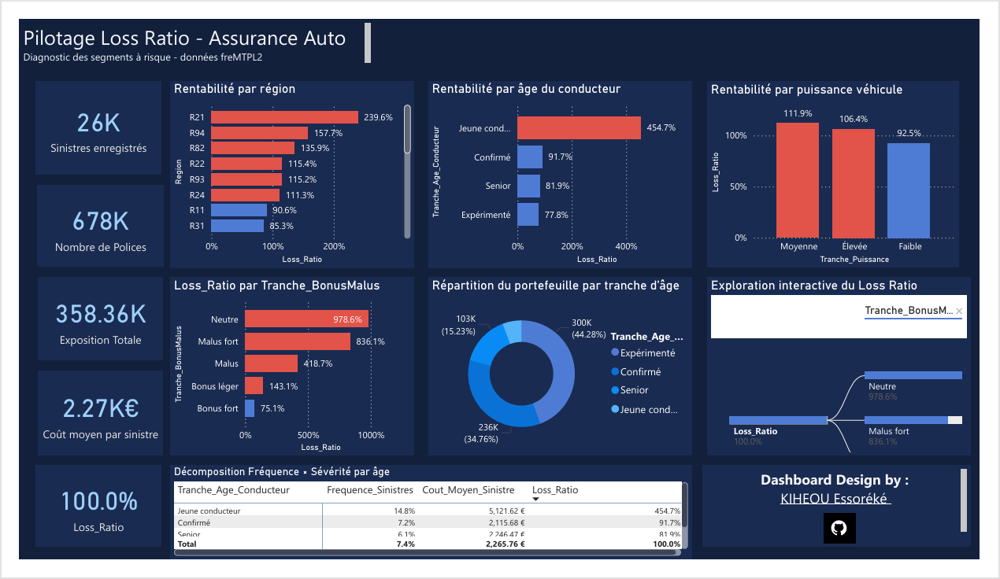

# powerbi-tarification-assurance
Dashboard Power BI - Diagnostic de la sinistralité auto et modélisation d'une prime actuarielle

# 🚗 Diagnostic Loss Ratio - Assurance Auto

Dashboard Power BI d'analyse de la sinistralité automobile, construit sur 678 000 polices d'assurance réelles (dataset freMTPL2), avec simulation d'une prime actuarielle et diagnostic des segments de risque sous-tarifés.

## Contexte & Problématique

Un directeur technique assurance auto observe que le Loss Ratio (ratio sinistres/primes) de son portefeuille augmente depuis 2 ans, sans en identifier la cause précise : tarification inadaptée ? Concentration du risque sur certains segments ? Ce projet reproduit la démarche d'un data analyst chargé de répondre à cette problématique.

## Objectif

Identifier les segments de portefeuille structurellement déficitaires (Loss Ratio > 100%), en distinguant les signaux statistiquement fiables des artefacts liés à un faible volume de données, puis formuler une recommandation de tarification actionnable.

## Données

- **Source** : [freMTPL2freq / freMTPL2sev](https://www.openml.org/d/41214) - dataset public French Motor Third-Party Liability (Christophe Dutang, Computational Actuarial Science with R, CRC 2018)
- **Volume** : 678 013 polices, 26 383 sinistres
- **Variables clés** : exposition, âge conducteur, puissance véhicule, région, coefficient Bonus-Malus, montant des sinistres

##  Méthodologie

1. **Préparation des données** (Power Query) : nettoyage, contrôle qualité (bornes métier : âge ≥18, exposition ∈[0,1], Bonus-Malus ∈[50,350]), jointure des tables fréquence/sévérité
2. **Modélisation** : modèle en étoile, tables `Freq_Polices` / `Sev_Sinistres` reliées par `IDpol`
3. **Simulation d'une prime pure actuarielle** (DAX), en l'absence de données de primes réelles dans le dataset : Prime Pure = Fréquence de sinistres × Coût moyen par sinistre

4. **Contrôle de crédibilité statistique** : chaque signal a été vérifié sur son volume de sinistres observés avant d'être retenu comme conclusion (seuil de vigilance : <50 sinistres)
5. **Analyse croisée** (matrices DAX) pour distinguer les effets de fréquence et de sévérité, et détecter les effets de confusion entre variables (ex : âge × puissance véhicule)

## Insights principaux

### 1. Un segment restreint concentre l'essentiel de la perte
Les jeunes conducteurs (18-25 ans), 5,7% du portefeuille, affichent un Loss Ratio de **454,7%** (vs 77-92% pour les autres tranches d'âge). Signal statistiquement solide (2 403 sinistres observés).

### 2. Effet cumulatif fréquence × sévérité
Le croisement âge × puissance révèle un Loss Ratio de **897,6%** chez les jeunes conducteurs avec véhicule de puissance moyenne : fréquence de sinistres 2,3x supérieure à la moyenne, sévérité (coût moyen par sinistre) 3,9x supérieure.

### 3. Angle mort du système Bonus-Malus
Les polices au coefficient neutre (100 - typiquement les nouveaux conducteurs sans historique) affichent le Loss Ratio le plus élevé du portefeuille (**978,6%**). Le système actuel, basé sur l'historique, ne peut par construction pas anticiper le risque des nouveaux entrants.

## Recommandation

Mettre en place une surprime ciblée dès la souscription pour les jeunes conducteurs sur véhicules de puissance moyenne à élevée, plutôt que de s'appuyer uniquement sur la correction a posteriori du Bonus-Malus.

## Limites

- Absence de données de primes réelles dans le dataset (prime pure simulée)
- Le signal régional (une région à 239,6% de Loss Ratio) repose sur un faible volume (77 sinistres) - à interpréter avec prudence
- Absence d'indicateur de fraude dans le dataset source
- Dataset figé dans le temps (pas de flux temps réel)

## Aperçu du dashboard

## Stack technique

- **Power Query** : nettoyage et préparation des données
- **DAX** : mesures actuarielles (fréquence, sévérité, prime pure, Loss Ratio), mise en forme conditionnelle par règles
- **Power BI** : modélisation en étoile, arborescence de décomposition interactive, paramètre de champ

## Structure du repo

├── README.md
├── dashboard.pbix
├── screenshots/
└── docs/
├── note-cadrage.md
└── methodologie.md

## Contact

Essoréké KIHEOU — [LinkedIn](#) — essorekekiheou@gmail.com
